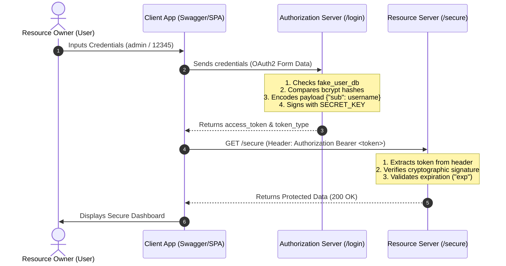

# 🔐 Module 11 — JWT Authentication (OAuth2, Hashing, & Architecture)

> **Goal:** Master the core fundamentals of **OAuth2 Access Delegation**, password hashing, and token-based stateless security in FastAPI, based on industry-standard security architectures.

---

## 🧠 Core OAuth2 Fundamentals & Terminology

Before looking at the code, it is essential to understand the roles defined by the **OAuth2 protocol** (an open standard for access delegation):

1.  **Resource Owner (The End-User):** The person who owns the account/data (in our app, this is the human logging in as `admin`).
2.  **The Client:** The application requesting access to resources on behalf of the Resource Owner. 
    > ⚠️ **Important:** "Client" does *not* mean the end-user. It means the application (e.g., your React SPA, Swagger UI, or Postman) executing the request.
3.  **The Authorization Server:** The server that validates credentials and issues the signed cryptographic token (in our app, this is the `/login` route).
4.  **The Resource Server:** The API hosting the protected endpoints and validating incoming tokens (in our app, this is the `/secure` route).

---

## 🔄 Detailed Flowchart: How it Works

Here is how the authentication and resource access flow executes step-by-step:



---

## 🔄 Detailed Execution Steps (Concept to Code)

Here is how the theoretical concepts map directly to the lines of code in your script:

### Step 1: The Access Request
*   **Concept:** The Client collects the credentials.
*   **Code:** Swagger UI parses your `username` and `password` via `OAuth2PasswordRequestForm = Depends()`.

### Step 2: The Ticket (JWT) is Issued
*   **Concept:** The Authorization Server verifies who you are and gives you a signed wristband (token) containing your permissions (scopes/subject).
*   **Code:**
    *   The server fetches `'admin'` from `fake_user_db` and compares hashes using `verify_password()`.
    *   `create_token()` encodes the username into the `"sub"` key (subject) of the JWT payload and adds an expiration timestamp (`"exp"`).
    *   The server signs this token with your `SECRET_KEY` and returns it under the key `"access_token"`.

### Step 3: Presenting the Token
*   **Concept:** The client wants protected resources. It attaches the token to subsequent HTTP requests.
*   **Code:** Swagger UI automatically injects the token into the request header: `Authorization: Bearer <your_token>`

### Step 4: Token Validation
*   **Concept:** The Resource Server must verify that the token was signed by a trusted source and has not been altered (tampered with).
*   **Code:**
    *   `get_current_user()` intercepts the request and pulls the token using `oauth2_scheme`.
    *   `jwt.decode(token, SECRET_KEY...)` verifies the signature.
    *   Because it uses cryptography, the Resource Server does not need to query the database to verify the user. It simply checks if the signature matches the secret key. If it does, it trusts the payload and returns the username.

---

## 🧱 Code Breakdown: How Theory Maps to Python

### 1. Secure Hashing (`passlib` + `bcrypt`)
*   **The Theory:** Never store raw passwords. If a database is leaked, hackers can read passwords in clear text. Hashing is a one-way mathematical function.
*   **The Code:**
    ```python
    pwd_context = CryptContext(schemes=["bcrypt"], deprecated="auto")
    ```
    This configures a context using `bcrypt` (a slow, salt-based hashing algorithm designed to resist brute-force attacks). When checking logins, we use `pwd_context.verify(plain, hashed)` to safely compare the input password to the database hash.

### 2. Token Generation (`create_token`)
*   **The Theory:** Once credentials match, the Authorization Server issues a **JSON Web Token (JWT)** containing claims (claims are statements about the user, like their ID or username) and an expiration timestamp.
*   **The Code:**
    ```python
    def create_token(data: dict):
        to_encode = data.copy()
        expiry = datetime.now(timezone.utc) + timedelta(minutes=30)
        to_encode.update({"exp": expiry})
        token = jwt.encode(to_encode, SECRET_KEY, algorithm=ALGORITHM)
        return token
    ```
    *   `"exp"`: Restricts the token validity window (30 minutes). If stolen, the window of vulnerability is limited.
    *   `"sub"`: The standard OAuth2 key for the **subject** (the unique identity of the user).

### 3. Stateless Verification (`get_current_user`)
*   **The Theory:** The Resource Server does not need to query the database on every single request. It only decodes the token and verifies the signature using the `SECRET_KEY`. If the signature matches, the server knows the token is authentic and untampered with.
*   **The Code:**
    ```python
    payload = jwt.decode(token, SECRET_KEY, algorithms=[ALGORITHM])
    ```
    If an attacker tries to change the payload (e.g. changing `"sub": "guest"` to `"sub": "admin"`), the cryptographic signature check will fail, throwing `jwt.JWTError`.

---

## 🧠 Core Fundamentals to Remember

*   **JWTs are Stateless:** The API doesn't store active tokens in a session table. The token itself contains all the verification data needed. The signature guarantees it hasn't been altered.
*   **Payload is public:** A JWT payload is only base64-encoded, not encrypted. Anyone can decode it. **Never put raw passwords or credit card numbers in the token payload.**
*   **Why use standard Identity Providers in production?** As the article advises, writing secure cryptography, handling session revoking (logout), refresh tokens, and preventing CSRF/replay attacks is extremely complex. For production apps, developers typically use established services (like Auth0, Keycloak, or AWS Cognito) for the Authorization Server role, while writing their Resource Servers (APIs) in FastAPI.

---

## 🔒 Do's and Don'ts of OAuth2 & JWTs

*   ✅ **DO** use established Identity Providers (like Auth0, Keycloak, or Okta) for the *Authorization Server* role in complex enterprise production setups.
*   ✅ **DO** verify tokens on the API side using cryptography (stateless authentication).
*   ❌ **DON'T** put secret credentials or personal data (like passwords, emails, SSNs) inside the JWT payload. The payload is only Base64-encoded; anyone who intercepts the token can decode and read it.
*   ❌ **DON'T** use the obsolete *Implicit Grant* (where tokens are sent directly in URLs) for Single Page Applications. Use **Authorization Code Flow with PKCE** instead.

---

## 🚀 How to Run & Test (Swagger UI magic)

1.  Start the app:
    ```bash
    cd auth
    uvicorn app:app --reload
    ```
2.  Open `/docs` (`http://127.0.0.1:8000/docs`). You will see a green **Authorize** lock button.
3.  Click it, input the credentials:
    *   **Username:** `admin`
    *   **Password:** `12345`
4.  FastAPI automatically uses `OAuth2PasswordRequestForm` behind the scenes to authenticate your inputs, fetches the token, and attaches it as a Bearer authorization header to all future requests. 
5.  Try running the `GET /secure` route—it will succeed automatically!

---

## 🎯 Interview Quick-Fire

**Q: What is the main difference between Cookie/Session Auth and JWT Auth?**
> A: Session auth is **stateful** (the server stores session IDs in a DB or memory cache and checks it on every request). JWT auth is **stateless** (the token itself contains all the verification data and is verified cryptographically by the server using a secret key without any database calls).

**Q: What is the structure of a JWT?**
> A: A JWT consists of three parts separated by dots (`.`):
> 1. **Header:** Details the algorithm and token type.
> 2. **Payload:** Holds the user data claims (e.g., `sub` and `exp`).
> 3. **Signature:** Calculated hash verifying the token was signed with the private `SECRET_KEY`.

---

[← Previous: Database Integration](../database/README.md) | [Back to Main README](../README.md) | [Next: Async/Await →](../async/README.md)
